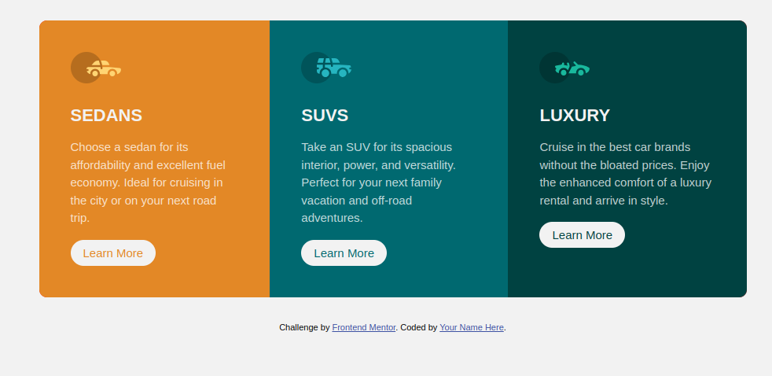
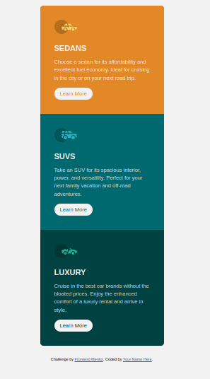

# Frontend Mentor - 3-column preview card component solution

This is a solution to the
[3-column preview card component challenge on Frontend Mentor](https://www.frontendmentor.io/challenges/3column-preview-card-component-pH92eAR2-).

## Table of contents

- [Overview](#overview)
  - [The challenge](#the-challenge)
  - [Screenshot](#screenshot)
  - [Links](#links)
- [My process](#my-process)
  - [Built with](#built-with)
  - [What I learned](#what-i-learned)

## Overview

### The challenge

Users should be able to:

- View the optimal layout depending on their device's screen size

### Screenshot

 

### Links

- Solution URL:
  https://github.com/ahmad-kashkoush/FrontEnd-Mentors-exercices/tree/main/3-column-preview-card-component-main
- Live Site URL:
  https://ahmad-kashkoush.github.io/FrontEnd-Mentors-exercices/3-column-preview-card-component-main/

## My process

### Built with

- Semantic HTML5 markup
- CSS custom properties
- Flexbox
- Mobile-first workflow
