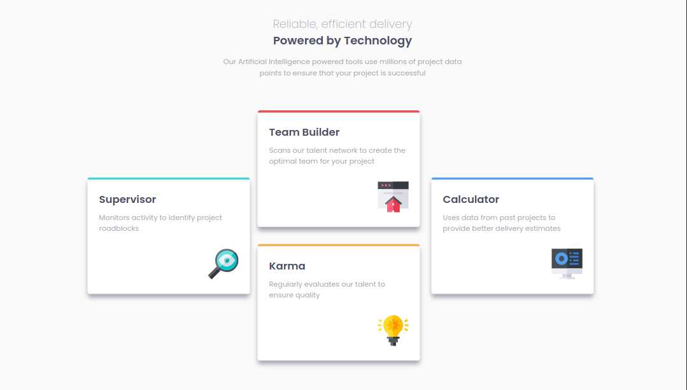
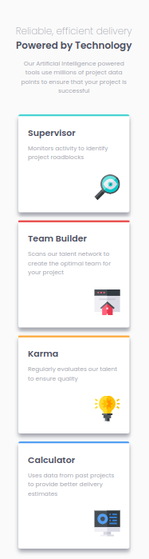

# Frontend Mentor - Four card feature section solution

This is a solution to the
[Four card feature section challenge on Frontend Mentor](https://www.frontendmentor.io/challenges/four-card-feature-section-weK1eFYK).

## Table of contents

- [Screenshot](#screenshot)
- [Links](#links)
- [My process](#my-process)
  - [Built with](#built-with)
  - [Useful resources](#useful-resources)

## Screenshot

 

## Links

- Solution URL:
  [Github Repo](https://github.com/ahmad-kashkoush/four-card-feature-section-master/)
- Live Site URL:
  [Live Demo](https://ahmad-kashkoush.github.io/four-card-feature-section-master/)

## My process

### Built with

- Semantic HTML5 markup
- CSS custom properties
- Flexbox
- CSS Grid
- Mobile-first workflow

### Useful resources

- [web.dev](https://web.dev/learn/html/images?continue=https%3A%2F%2Fweb.dev%2Flearn%2Fhtml%23article-https%3A%2F%2Fweb.dev%2Flearn%2Fhtml%2Fimages) -
  helped me in learning images and image tags
