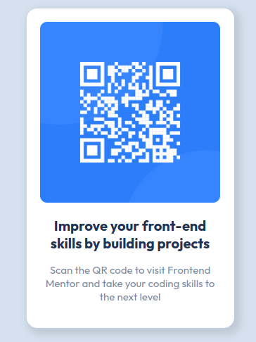

# Frontend Mentor - QR code component solution

This is a solution to the
[QR code component challenge on Frontend Mentor](https://www.frontendmentor.io/challenges/qr-code-component-iux_sIO_H).

## Table of contents

- [Overview](#overview)
  - [Screenshot](#screenshot)
  - [Links](#links)
- [My process](#my-process)
  - [Built with](#built-with)
  - [What I learned](#what-i-learned)
  - [Continued development](#continued-development)
  - [Useful resources](#useful-resources)

## Overview

### Screenshot

 

### Links

- Solution URL:
  [solution URL](https://github.com/ahmad-kashkoush/FrontEnd-Mentors-exercices/tree/main/qr-code-component-main)
- Live Site URL:
  [site URL](https://ahmad-kashkoush.github.io/FrontEnd-Mentors-exercices/qr-code-component-main/)

## My process

### Built with

- Semantic HTML5 markup
- CSS custom properties
