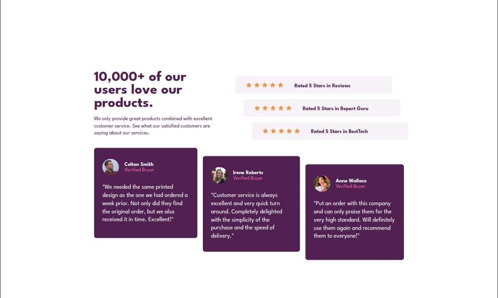
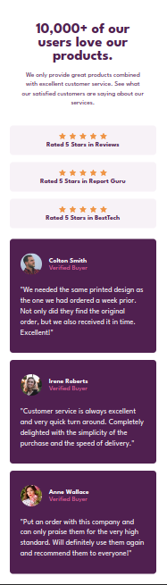

# Frontend Mentor - Social proof section solution

This is a solution to the
[Social proof section challenge on Frontend Mentor](https://www.frontendmentor.io/challenges/social-proof-section-6e0qTv_bA).

### Screenshot

 

### Links

- Solution URL:
  [Github Repo](https://ahmad-kashkoush.github.io/FrontEnd-Mentors-exercices/social-proof-section-master/)
- Live Site URL:
  [Live Demo](https://ahmad-kashkoush.github.io/FrontEnd-Mentors-exercices/social-proof-section-master/)

### Built with

- Semantic HTML5 markup
- CSS custom properties
- Flexbox
- CSS Grid
- Mobile-first workflow
